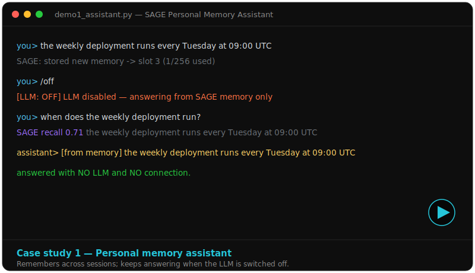
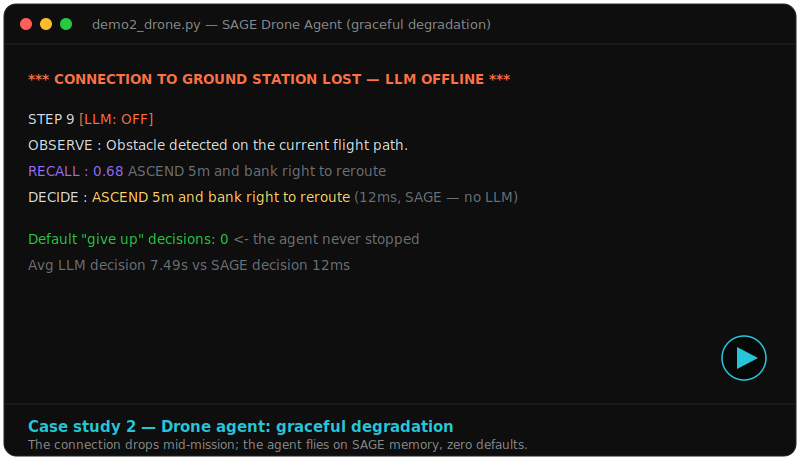
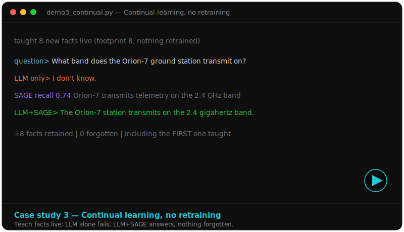
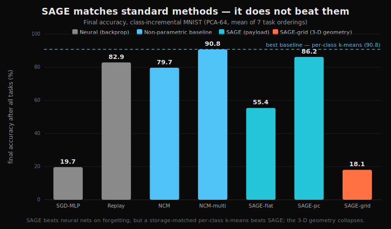

<p align="center">
  
</p>

<h3 align="center">A weight-free, gradient-free associative memory for AI agents</h3>

<p align="center">
  It runs, it remembers, and it keeps working when the LLM is offline.
</p>

---

> **Honest summary.** SAGE stores knowledge as embedding vectors at fixed slots,
> retrieves by cosine similarity, and writes with local Hebbian updates — **no
> backpropagation, no retraining**. Tested against strong baselines, it **beats
> gradient-trained neural networks on catastrophic forgetting** but **ties** the
> simple non-parametric methods (nearest-class-mean, per-class k-means) — it does
> not beat them. The 3-D "geometry" is a visualization/addressing layer, not the
> computation. This repository is a working system **plus** an honest, baseline-
> anchored study that reports exactly where a geometric memory does and does not
> help.
>
> *This supersedes the earlier "the geometry computes / 0.000% sparsity" framing.
> See [`papers/`](papers/) (v2/v3) and the reconciliation table in the main paper.*

## See it work — three case studies

LLM (local, via Ollama) + SAGE as the memory layer. Each is a short screen recording.

| | |
|---|---|
|  |  |
| **Personal memory assistant** — remembers across sessions; answers from memory when the LLM is switched off. | **Drone: graceful degradation** — the connection drops mid-mission; the agent flies on SAGE alone, zero defaults. |
|  | |
| **Continual learning** — teach facts live; LLM alone fails, LLM+SAGE answers, nothing forgotten, no retraining. | |

Run them: [`demos/`](demos/) (self-contained — `python demos/demo2_drone.py`).

## What the study found

<p align="center"></p>

| Method (class-incremental MNIST) | final acc % | forgets? |
|---|---|---|
| SGD-MLP (neural) | 19.7 | yes (cliff) |
| Replay (neural + buffer) | 82.9 | partial |
| NCM (1 mean/class) | 79.7 | no |
| **NCM-multi (per-class k-means)** | **90.8** | no |
| **SAGE (per-class)** | **86.2** | no |
| SAGE-grid (3-D geometry) | 18.1 | collapses |

SAGE beats the neural baselines on forgetting; a storage-matched per-class k-means
beats SAGE (McNemar p ≈ 4×10⁻¹³); the coordinate-routing variant collapses,
confirming the geometry is not load-bearing. Relational reasoning by graph
traversal ties plain vector arithmetic, and three follow-up "kill-shots"
(noisy binding, fixed-footprint superposition, relation discovery) each tie or
lose to a standard method. Every number is traceable to a file in
[`results/`](results/); the full log is [`findings.md`](findings.md).

## Quickstart

```bash
# 1. Python deps
pip install -r requirements.txt          # numpy, scipy, scikit-learn, matplotlib, torch

# 2. Local LLM + embeddings via Ollama (https://ollama.com)
ollama serve
ollama pull nomic-embed-text
ollama pull mistral                      # or set SAGE_LLM to a model you have

# 3. Run a demo (from the repo root)
python demos/demo2_drone.py              # graceful degradation, ~1 min
python demos/demo3_continual.py          # continual learning, ~1 min
python demos/demo1_assistant.py          # interactive memory assistant
```

## Repository layout

```
core/            gradient-free memory + binding + retrieval primitives
experiments/     the staged study, forgetting benchmark, and the 3 kill-shots
demos/           the three LLM + SAGE case-study demos (self-contained)
results/         JSON + PNG every paper number traces to
papers/          v3 papers (main + drone, docx + pdf) + figures + v2 drafts
web_assets/      logo, charts, case-study posters
findings.md      per-experiment log (the honest record)
cube_core*.py    the original Cartesian-cube implementation (V1-V4)
archive_v1/      superseded v1 paper PDFs (kept for history)
```

> Note: the embedding caches and GloVe/analogy data are not committed (large,
> regenerable). The continual-learning benchmark runs on sklearn/MNIST out of the
> box; the embedding experiments need Ollama + `nomic-embed-text`.

## How it works (positioning)

SAGE is a bounded online associative memory. Its **read** is the modern-Hopfield /
attention operation; its **merge-write** is a hard delta-rule fast-weight update;
its **decay** is palimpsest forgetting. It introduces no new retrieval mechanism —
its value is a transparent, weight-free, gradient-free *instantiation* with
directly inspectable slots, for regimes where backpropagation is unavailable or
undesirable (edge / neuromorphic / streaming).

## Papers

- **SAGE: A Weight-Free Bounded Associative Memory** (main) —
  [`papers/SAGE_v3_main.pdf`](papers/SAGE_v3_main.pdf).
- **Graceful Degradation in Autonomous Agents** (drone) —
  [`papers/SAGE_v3_drone.pdf`](papers/SAGE_v3_drone.pdf).

Both are v3 revisions that add the missing baselines and correct the earlier
overclaims. The earlier published v1 (DOI 10.5281/zenodo.19192937) is superseded.

## Honest-research note

The value of this project is as much the **method** as the system: every claimed
win was tested against its strongest classical baseline, with a multi-angle
code-review process that caught overclaims in **both** directions (false wins *and*
false losses) before they were believed. The result is a clean falsification arc —
a worked example of reporting research straight.

## Citation

See [`CITATION.cff`](CITATION.cff).

## License

MIT — see [`LICENSE`](LICENSE).
